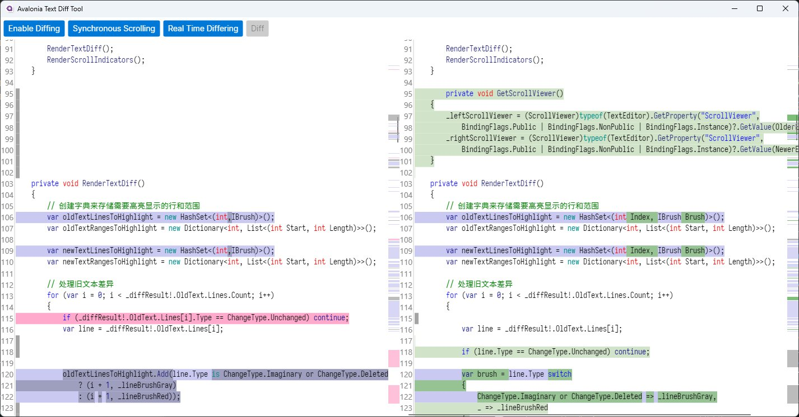
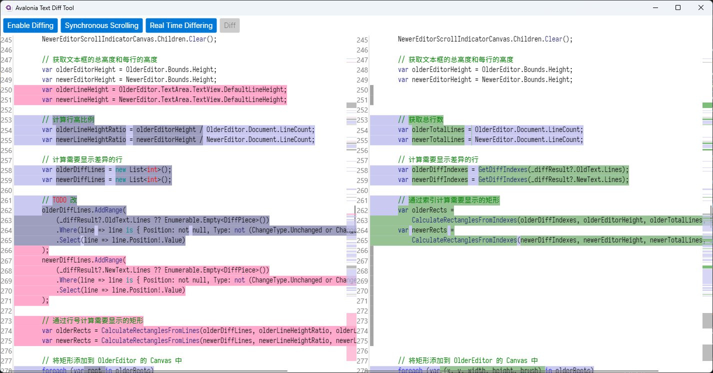

# Avalonia Text Diff Tool
适用于 Avalonia `0.10.x` 版本的一个文本/代码差异实时比较工具，可以用来塞进其他项目里面。

# 有啥功能

- 实时编辑和实时差异显示
- 两侧文本框同步滚动
- 侧边快速预览更改位置

# 引哪些库
- [mmanela/diffplex](https://github.com/mmanela/diffplex)
  - 这个库很好👍，干净整洁速度快！
- [AvaloniaUI/AvaloniaEdit](https://github.com/AvaloniaUI/AvaloniaEdit)
  - 一比吊糟，不知道是不是氯气吸多了整出来的半成品，每次找到一个看起来很牛逼的方法，调用一下发现没有任何卵用，进去查代码发现里面一行实现都没写，你搁这开发接口呢？
- [XuanXiaoming/Sarasa-Mono-SC-Nerd](https://github.com/XuanXiaoming/Sarasa-Mono-SC-Nerd)
  - 因为AvaloniaEdit不支持字体 Fallback，所以使用同时支持中英文的更纱黑体的等宽版本，用于编辑器文本区域

# 截几张图

